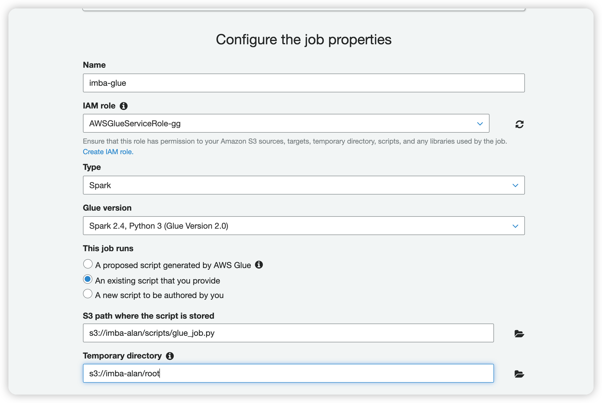
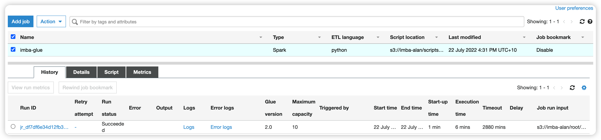

# Use `AWS Glue job` to run python scripts for ETL process

- ### Prepare the script
Save the codes from 'glue-job.ipynb' into one single python file 'glue_job.py' and upload it to s3 bucket.
- ### Create a job in Glue console as follows:

We need to provide an IAM role attached with Amazon S3 access and AWSGlueServiceRole policies. Then, we need to choose an existing script and set the s3 paths for the scipt and the temporary folder correctly.
- ### Run the job and wait for the output - a single data csv file to be created successfully in the s3 bucket. The result is as follows:
