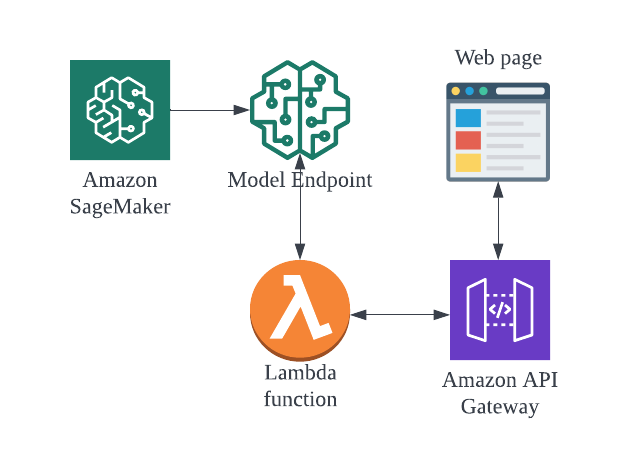
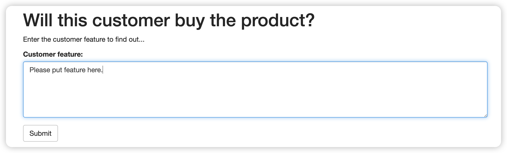

# Machine learning endpoint deployment by AWS SageMaker
High level structure:


## **1. Model training and deployment**
Data science team used `SageMaker` jupyter notebook to develop the machine learning model by employing XGBoost package. This process involved feature engineering, hyperparameter tuning and modele testing. When the model was ready, it was deployed as an endpoint by `SageMaker`. Please check [Model_development.ipynb](Model_development.ipynb) for detaild steps.
## **2. Set up lambda functions to invoker the model**
We could then invoker this endpoint by using lambda function:
```python
# We need to use the low-level library to interact with SageMaker since the SageMaker API
# is not available natively through Lambda.
import boto3

def lambda_handler(event, context):

    body = event['body']

    # The SageMaker runtime is what allows us to invoke the endpoint that we've created.
    runtime = boto3.Session().client('sagemaker-runtime')

    # Now we use the SageMaker runtime to invoke our endpoint, sending the review we were given
    response = runtime.invoke_endpoint(EndpointName = '***ENDPOINT NAME HERE***',# The name of the endpoint we created
                                       ContentType = 'text/csv',                 # The data format that is expected
                                       Body = body
                                       )

    # The response is an HTTP response whose body contains the result of our inference
    result = response['Body'].read().decode('utf-8')

    # Round the result so that our web app only gets '1' or '0' as a response.
    result = float(result)

    return {
        'statusCode' : 200,
        'headers' : { 'Content-Type' : 'text/plain', 'Access-Control-Allow-Origin' : '*' },
        'body' : str(result)
    }
```

## **3. Set up an `AWS API Gateway`**
Created an AWS Gateway, chose the REST API, selected the POST method action, chose the integration type as Lambda Function and lanuched the gateway. Added the gateway as the trigger of the lambda function and saved the API URL. Inserted this URL into the test webpage [index_imba](./assets/index_imba.html) as the POST method action.

## **4. Test the feature of user product pair on the webpage**
Input the feature data, and clicked submit. The webpage would sent the feature data to the API gateway which would invoke the lambda function. The lambda function then would invoke the SageMaker model enpoint and returned the results. The gateway would then send back the results to the interactive webpage:


More details please check: [Model_deployment](./Model_deployment.ipynb)

## **5. Enhancement of the web interface**
Alternatively we can store the feature data of each user product pair into a dynamo DB (table imba). Then the client only needs input a pair of the user_id and product_id, the feature data will be retrived from the database and used in the Lambda function
The Lambda function can be written this way:
```python
import boto3

dynamodb = boto3.resource('dynamodb')
table = dynamodb.Table('imba')

def lambda_handler(event, context):

    body = event['body']
    #print(event)
    user_id = body.split(',')[0]
    product_id = body.split(',')[1]
    
    response = table.get_item(Key={'user_id': user_id, 'product_id': product_id})
    print(response)
    body = response['Item']['feature']
    
    #exit()
    # The SageMaker runtime is what allows us to invoke the endpoint that we've created.
    runtime = boto3.Session().client('sagemaker-runtime')

    # Now we use the SageMaker runtime to invoke our endpoint, sending the review we were given
    response = runtime.invoke_endpoint(EndpointName = 'xgboost-2022-03-30-09-12-42-035',# The name of the endpoint we created
                                       ContentType = 'text/csv',                 # The data format that is expected
                                       Body = body
                                       )

    # The response is an HTTP response whose body contains the result of our inference
    result = response['Body'].read().decode('utf-8')

    # Round the result so that our web app only gets '1' or '0' as a response.
    result = float(result)

    return {
        'statusCode' : 200,
        'headers' : { 'Content-Type' : 'text/plain', 'Access-Control-Allow-Origin' : '*' },
        'body' : str(result)
    }
```