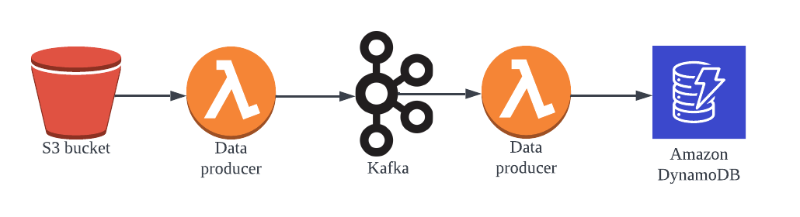

# Data streaming by Kafka cluster

Set a `Kafka` cluster on `Confluent`. The first Lambda funciton contains a `Confluent-kafka` producer which reads data from s3 bucket and sent them into the `Kafka` cluster. The second Lambda function will consume data in the `Kafka` cluster through a `Confluent` connector `AWS Lambda Sink`. The data comsumed will be written into an AWS DynamoDB. This infrasture allows scalability as Lambda function has limitation on processing large scale data. However Kafka cluster can hanlde large data size. 

- ### Create the lamdba functions
1. Lambda function (producer)

    The script body is  [cf_producer.py](./cf_producer.py). The runtime is Python 3.8. Set the  IAM role to be able to access the relavent S3 bucket. Add a layer importing [confluent.zip](./confluent.zip).
2. Lambda Function (consumer)

    The script body is [cf_consumer.py](./cf_consumer.py). The runtime is Python 3.8. Assign a role with permission to access the DynamoDB.

- ### Set up `Kafka` cluster in the `Confluent` cloud service
1. Create a basic cluster chosing AWS cloud
2. Create a topic chooing default partitions
3. Set the topic schema as [schema.json](./schema.json)
4. Under Data Integration, choose a new client (Python), then create an API key and use it as the parmenters input for the `Confluent` producer in the Lambda function (producer). Also, copy the Bootstrap server address into the producer.
5. Set up the `AWS Lambda Sink Connecter`. It needs the API key created. It also needs a pair of AWS access key ID and access key for authentication purpose. Follow the steps and connect it the right Lambda function (consumer).

