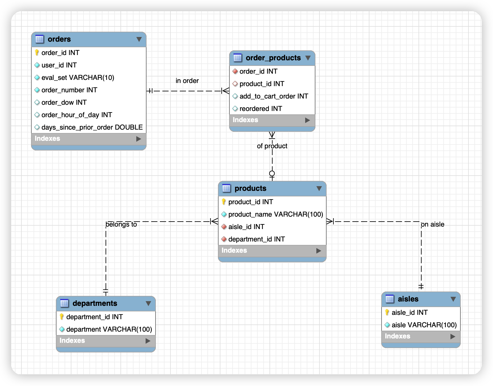

# **Draw an ER diagram to show the relationships of 5 tables created in Athena.**

We have used the AWS crawler to extract the schema of our ecommerce data set. ER diagrams consist of Conceptual, Logical and Physical Data Model. As we already had the schema availabe, I created the final version of physical ER data model by the following steps:

### 1. Create a local schema in mysql workbench
```sql
create DATABASE ecommerce;

use ecommerce;

create table aisles (
	aisle_id int,
    aisle varchar(100)
);

create table departments (
	department_id int,
    department varchar(100)
);

create table order_products (
	order_id int,
    product_id int,
    add_to_cart_order int,
    reordered int
);

create table orders (
	order_id int,
    user_id int,
    eval_set varchar(10),
    order_number int,
    order_dow int,
    order_hour_of_day int,
    days_since_prior_order double
);

create table products (
	product_id int,
    product_name varchar(100),
    aisle_id int,
    department_id int
);
```

### 2. Use reverse engineering to create the ER diagram in mysql workbench. Set relevant primary keys and NN values. Create relationships between the table. Set the mandotory or optional relationship (there may be prducts never ordered). Then, save the generated ER diagram:



# **Join orders table and order_products table together, filter on eval_set = ‘prior’**

```sql
SELECT * 
FROM orders INNER JOIN order_products
ON orders.order_id = order_products.order_id
WHERE orders.eval_set = 'prior'
ORDER BY orders.order_id;
```