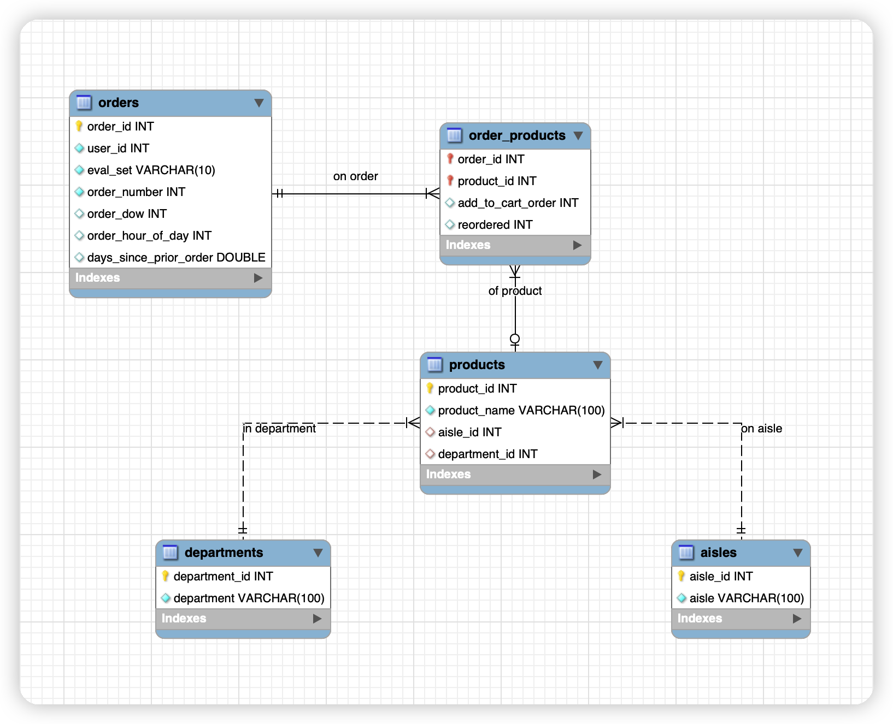
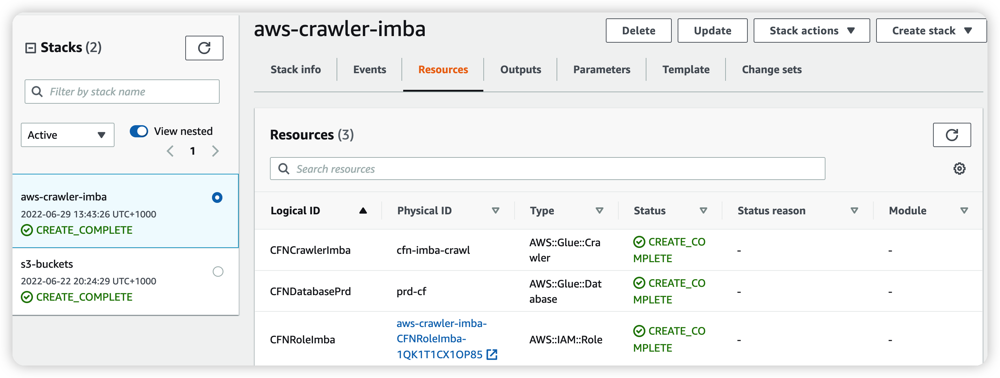
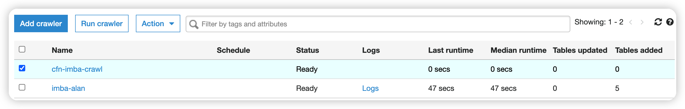
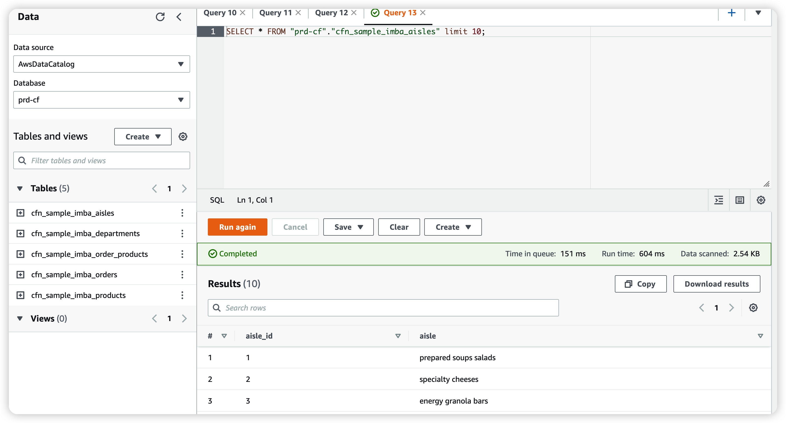

# **1. Draw an ER diagram to show the relationships of 5 tables created in Athena.**

We have used the `AWS crawler` to extract the schema of our ecommerce data set. ER diagrams consist of Conceptual, Logical and Physical Data Models. Noticeably, the **order_products** should be **associative entity** to resolve many-to-many relationship. As we already had the schema availabe, I created the final version of physical ER data model by the following steps:

- ### Create a local schema in `MySQL Workbench`
```sql
create DATABASE ecommerce;

use ecommerce;

create table aisles (
    aisle_id int,
    aisle varchar(100)
);

create table departments (
    department_id int,
    department varchar(100)
);

create table order_products (
    order_id int,
    product_id int,
    add_to_cart_order int,
    reordered int
);

create table orders (
    order_id int,
    user_id int,
    eval_set varchar(10),
    order_number int,
    order_dow int,
    order_hour_of_day int,
    days_since_prior_order double
);

create table products (
    product_id int,
    product_name varchar(100),
    aisle_id int,
    department_id int
);
```

- ###  Use reverse engineering to create the ER diagram in mysql workbench. Set relevant primary keys and NN values. Create relationships between the table. Set the mandotory or optional relationship (there may be prducts never ordered). Then, save the generated ER diagram:



# **2. Join orders table and order_products table together, filter on eval_set = ‘prior’**

```sql
-- run query in AWS athena will generate the results
SELECT * 
FROM orders INNER JOIN order_products
ON orders.order_id = order_products.order_id
WHERE orders.eval_set = 'prior'
ORDER BY orders.order_id;
```

# **3. Code as infrastructure: use the `AWS cloudformation` template to deploy an `AWS crawler` by running workflows in `github action` to faciliate CI/CD processes.**
- ### Cloudformation template:
```yml
# Build a stack for crawler services
Parameters:
  CFNCrawlerName: 
    Type: String
    Default: cfn-imba-crawl
  CFNDatabaseName:
    Type: String
    Default: cfn-imba
  CFNTablePrefixName:
    Type: String
    Default: cfn_sample_imba_	

# Resources section defines metadata for the Data Catalog
Resources:
#Create IAM Role assumed by the crawler. For demonstration, this role is given all permissions.
  CFNRoleImba:
    Type: AWS::IAM::Role
    Properties:
      AssumeRolePolicyDocument:
        Version: "2012-10-17"
        Statement:
          -
            Effect: "Allow"
            Principal:
              Service:
                - "glue.amazonaws.com"
            Action:
              - "sts:AssumeRole"
      Path: "/"
      Policies:
        -
          PolicyName: "root"
          PolicyDocument:
            Version: "2012-10-17"
            Statement:
              -
                Effect: "Allow"
                Action: "*"
                Resource: "*"
 # Create a database to contain tables created by the crawler
  CFNDatabasePrd:
    Type: AWS::Glue::Database
    Properties:
      CatalogId: !Ref AWS::AccountId
      DatabaseInput:
        Name: !Ref CFNDatabaseName
        Description: "AWS Glue container to hold metadata tables for the imba crawler"
 #Create a crawler to crawl the ecommerce data on a public S3 bucket
  CFNCrawlerImba:
    Type: AWS::Glue::Crawler
    Properties:
      Name: !Ref CFNCrawlerName
      Role: !GetAtt CFNRoleImba.Arn
      #Classifiers: none, use the default classifier
      Description: AWS Glue crawler to crawl imba data
      #Schedule: none, use default run-on-demand
      DatabaseName: !Ref CFNDatabaseName
      Targets:
        S3Targets:
          # Public S3 bucket with the flights data
          - Path: "s3://imba-alan/data/"
      TablePrefix: !Ref CFNTablePrefixName
      SchemaChangePolicy:
        UpdateBehavior: "UPDATE_IN_DATABASE"
        DeleteBehavior: "LOG"
      Configuration: "{\"Version\":1.0,\"CrawlerOutput\":{\"Partitions\":{\"AddOrUpdateBehavior\":\"InheritFromTable\"},\"Tables\":{\"AddOrUpdateBehavior\":\"MergeNewColumns\"}}}"
```
- ### Github workflow yml file:
```yml
name: Deploy CloudFormation Stacks

# Controls when the action will run.
on:
  # Allows you to run this workflow manually from the Actions tab
  workflow_dispatch:
    inputs:
      region:
        description: "AWS Region"
        required: true
        default: "ap-southeast-2"
      CFNDatabaseName:
        description: "Crawler database Name"
        default: "prd-cf"
        required: true

# A workflow run is made up of one or more jobs that can run sequentially or in parallel
jobs:
  cfn-deployment:
    runs-on: ubuntu-latest
    steps:
      - name: Checkout
        uses: actions/checkout@v2

      - name: Configure AWS credentials
        id: creds
        uses: aws-actions/configure-aws-credentials@v1
        with:
          aws-access-key-id: ${{ secrets.AWS_ACCESS_KEY_ID }}
          aws-secret-access-key: ${{ secrets.AWS_SECRET_ACCESS_KEY }}
          aws-region: ${{ github.event.inputs.region }} 

      - name: Deploy Crawler CloudFormation Stacks
        id: aws-crawler-imba
        uses: aws-actions/aws-cloudformation-github-deploy@v1.0.3
        with:
          name:  aws-crawler-imba
          template: cfn/crawler.yml
          parameter-overrides: >-
            CFNDatabaseName=${{ github.event.inputs.CFNDatabaseName }}
```
- ### Results:
#### **New stack is built successfully:**


#### **New crawler has been built and is waiting for running:**


#### **After running the new crawler, from `AWS Athena`, we can find the logical external tables are successully generated and stored in the new database:**
 