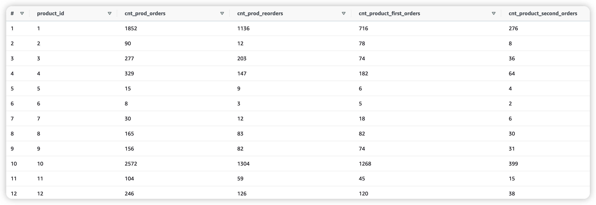

# 
### 1. Create a table called order_products_prior
```sql
CREATE TABLE order_products_prior WITH (external_location = 's3://imba-alan/features/order_products_prior/', format = 'parquet')
as (SELECT a.*, b.product_id,
b.add_to_cart_order,
b.reordered FROM orders a
JOIN order_products b
ON a.order_id = b.order_id
WHERE a.eval_set = 'prior');
```
### Table order_products_prior preview:


### 2. Create a SQL query (user_features_1). Based on table orders, for each user, calculate the max order_number, the sum of days_since_prior_order and the average of days_since_prior_order.
```sql
select user_id, max(order_number) AS max_ord_num, sum(days_since_prior_order) AS sum_of_days, round(AVG(days_since_prior_order),2) AS average_days_since_prior_order
from orders
group by user_id;
```
### Resulting table user_features_1 preview:


### 3. Create a SQL query (user_features_2). Similar to above, based on table order_products_prior, for each user calculate the total number of products, total number of distinct products, and user reorder ratio(number of reordered = 1 divided by number of order_number > 1)
```sql
select user_id, count(product_id) AS total_products, count(distinct product_id) AS total_distinct_products, 
round(CAST(sum(CASE WHEN reordered = 1 THEN 1 ELSE 0 END) AS double)/count(CASE 
                   WHEN order_number > 1 THEN 1
                   END),4) AS reordered_ratio
from order_products_prior
group by user_id;
```
### Resulting table user_features_2 preview:


### 4. Create a SQL query (up_features). Based on table order_products_prior, for each user and product, calculate the total number of orders, minimum order_number, maximum order_number and average add_to_cart_order.
```sql
select user_id, product_id, count(distinct order_id) AS total_number_of_orders, min(order_number) AS min_order_number, 
max(order_number) AS max_order_number, round(avg(add_to_cart_order),2) AS avg_add_to_cart_order
from order_products_prior
group by user_id, product_id;
```
### Resulting table up_features preview:


### 5. Create a SQL query (prd_features). Based on table order_products_prior, first write a sql query to calculate the sequence of product purchase for each user, and name it product_seq_time (For example, if a user first time purchase a product A, mark it as 1. If it’s the second time a user purchases a product A, mark it as 2).Then on top of this query, for each product, calculate the count, sum of reordered, count of product_seq_time = 1 and count of product_seq_time = 2.
```sql
-- subquery will generate the the sequence of product purchase for each user
select product_id, count(*) AS cnt_prod_orders, sum(reordered) AS cnt_prod_reorders, 
count(case when product_seq_time = 1 then 1 end) AS cnt_product_first_orders,
count(case when product_seq_time = 2 then 1 end) AS cnt_product_second_orders
from 
(select user_id, order_number, product_id, reordered,
sum(1) over (partition by user_id, product_id order by order_number) AS product_seq_time
from order_products_prior) a
group by product_id;
```
### Resulting table up_features preview:
