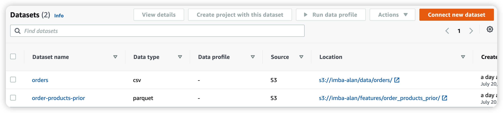
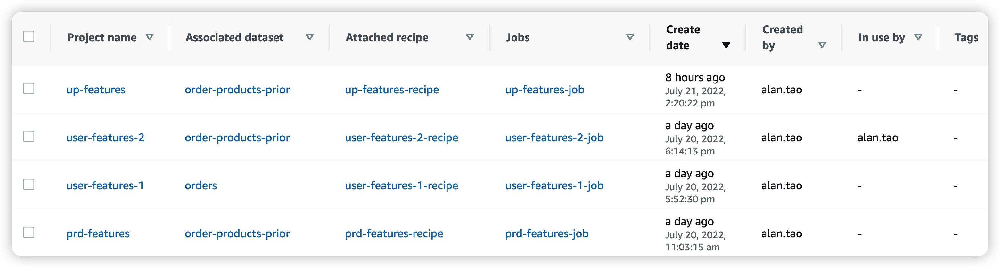
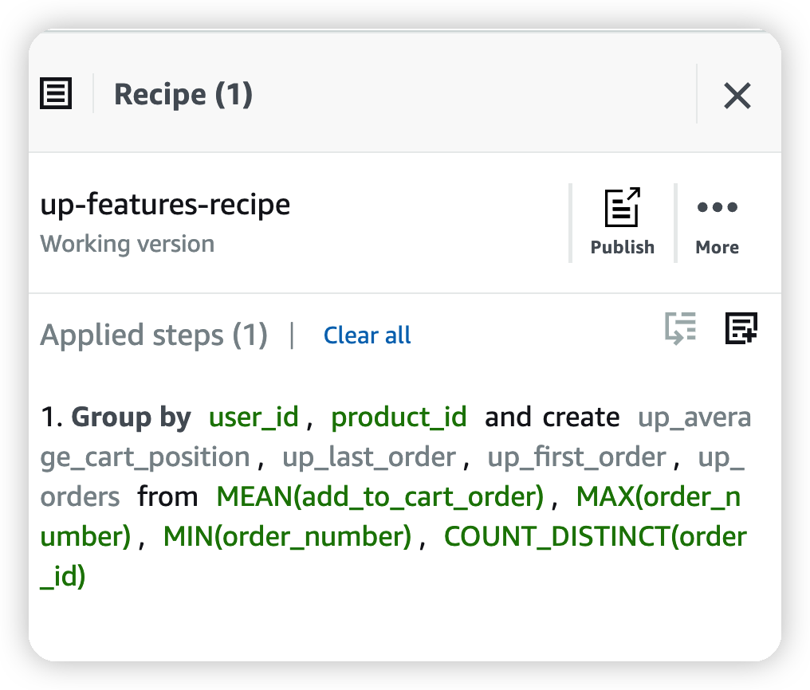
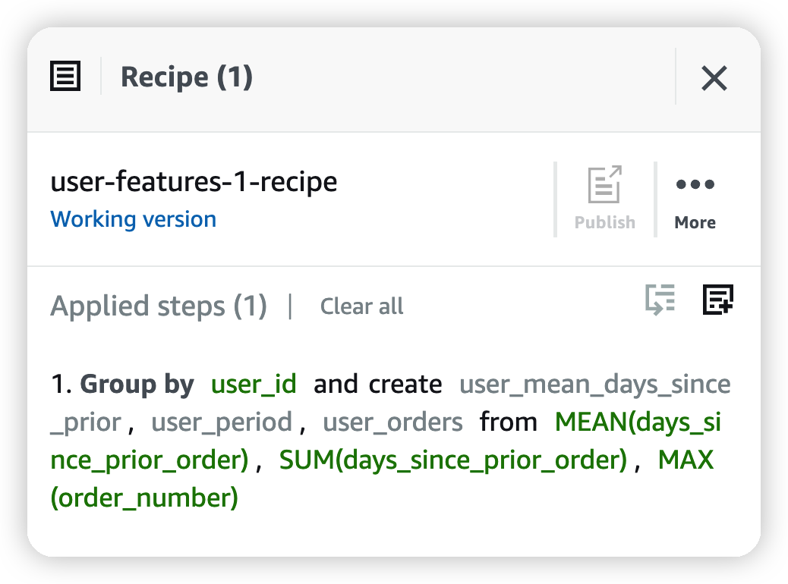
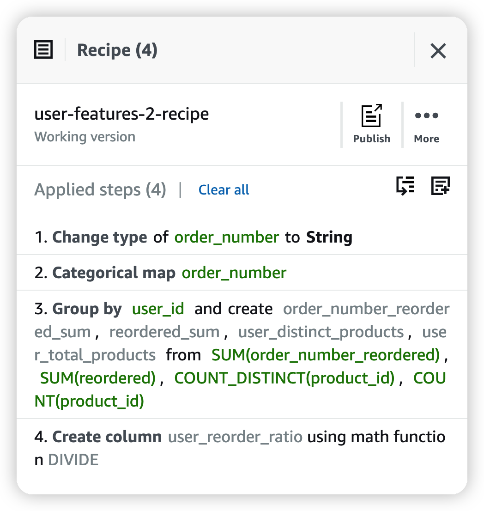
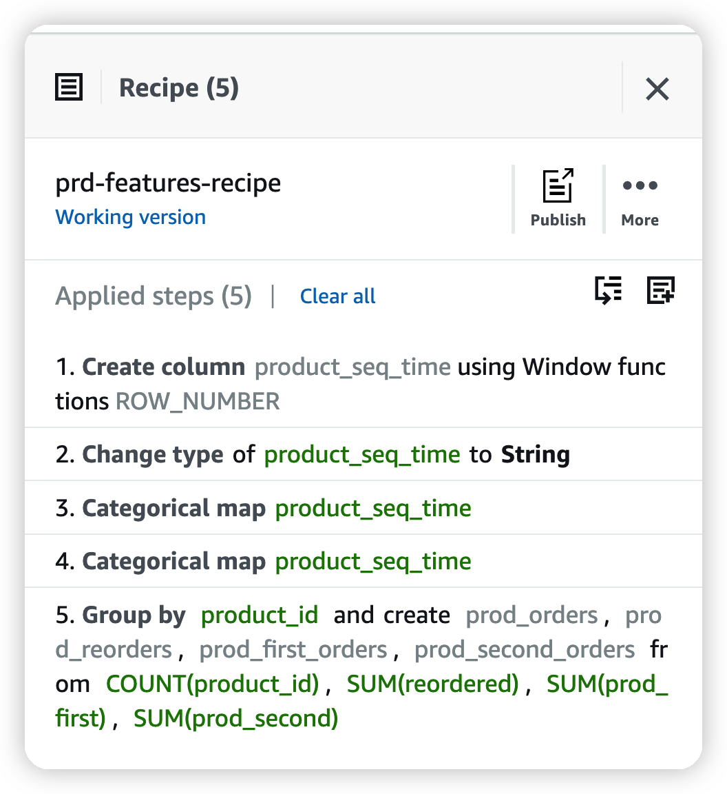
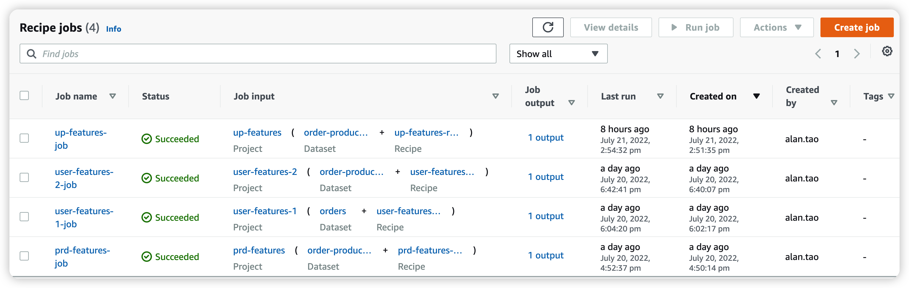
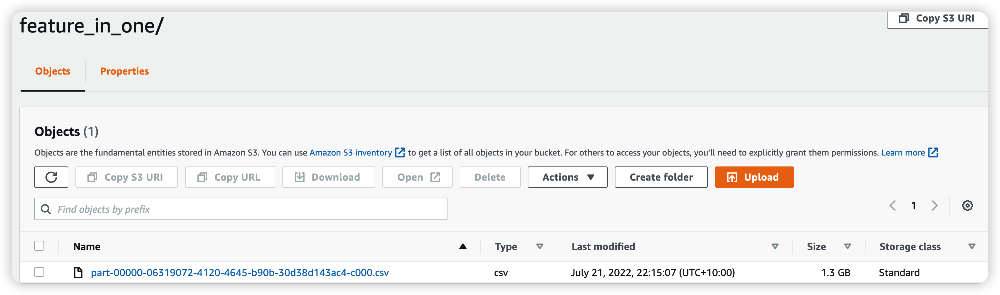

# ETL process using `AWS DataBrew` and `AWS glue studio`
### `AWS DataBrew` can conviniently clean and normalise data for ananlytics tasks
- ### Step 1 Create datasets using relevant s3 buckets

- ### Step 2 Create projects and associative recipes

1. up_features recipe:

2. user_features_1 recipe:

3. user_features_2 recipe:

4. prd_features recipe:

- ### Step 3 Create jobs to generate parquet files for each feature table and store them into S3 folders

- ### Step 4 Use glue studio to read the parquet files and join the four relational feature tables into one single table. Then export the dataframe as a single csv into s3 bucket. Please check the glue-job.ipynb notebook for the  codes.
