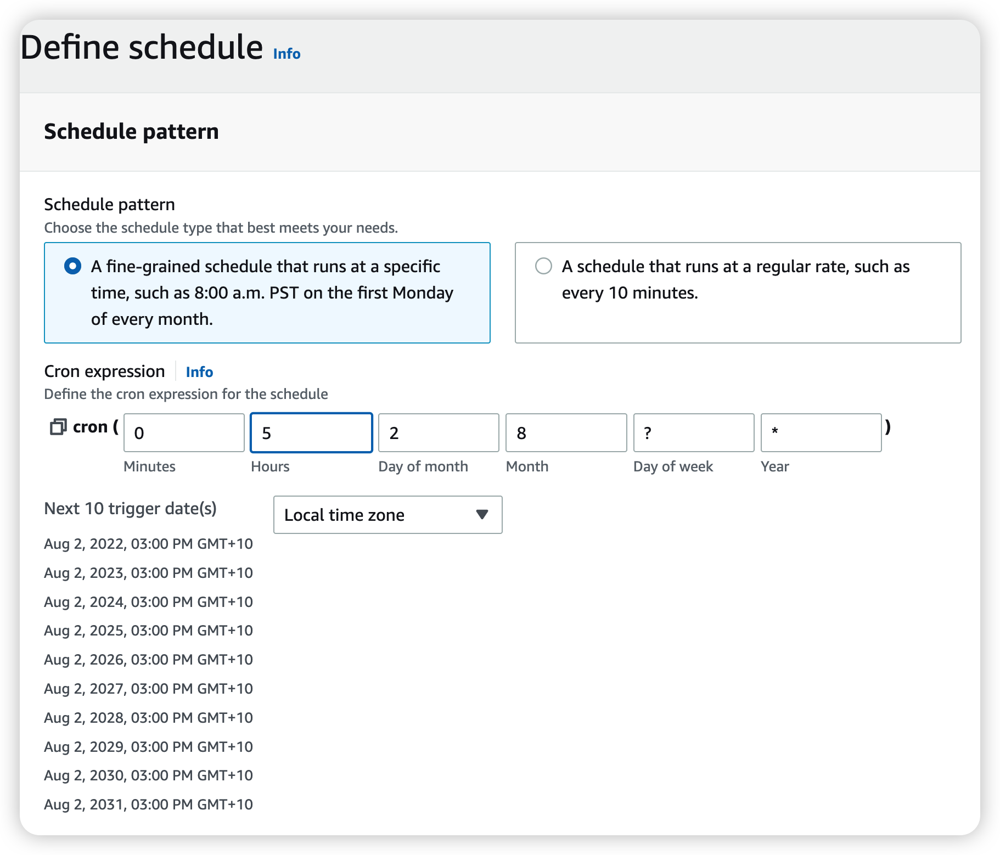
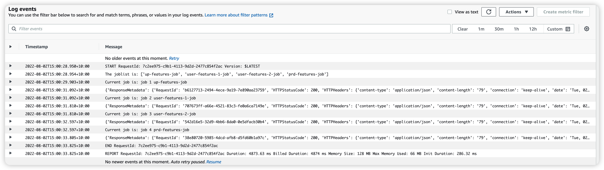
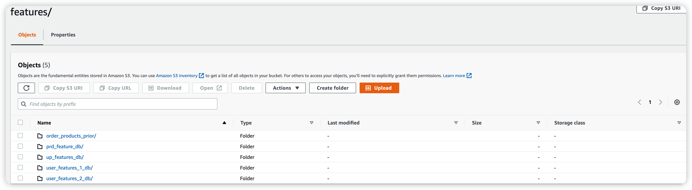
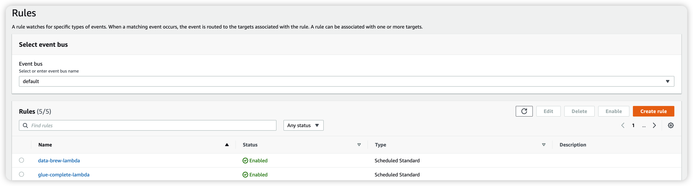
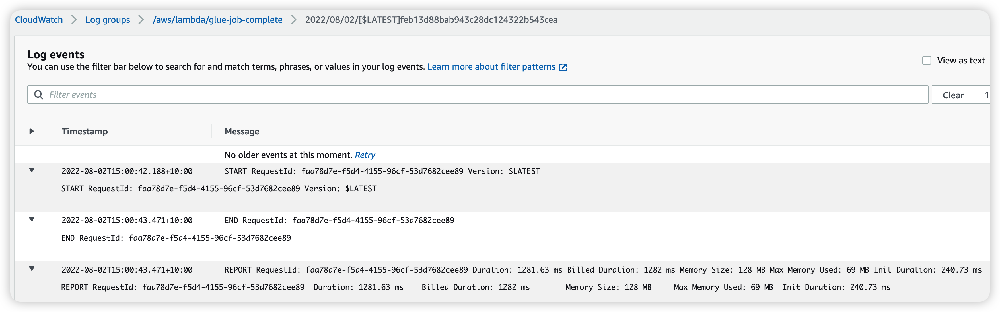
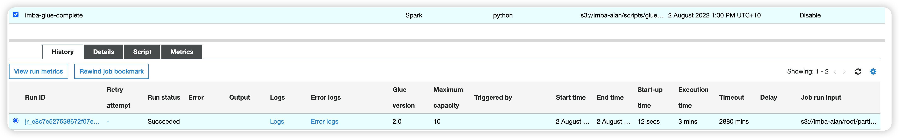
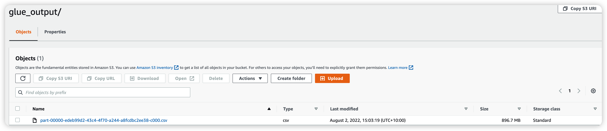

# Schedule `Lambda` functions to run `DataBrews` jobs and `Glue` job respectively to generate feature files instead of manual operations.

- ## **Approach one** Create Lambda function to run the `DataBrews` jobs.
Set the function's environment variables as up-features-job,user-features-1-job,user-features-2-job,prd-features-job.
Make sure to grant the Lambda functions' associated roles with sufficient permissions.
```python
import json
import boto3
import os

def lambda_handler(event, context):
    joblist = os.environ['JOB_LIST']
    joblist = joblist.split(',')
    print("The joblist is: ", joblist)
    client = boto3.client('databrew')
    count = 0
    for job in joblist:
        count = count + 1
        print("Current job is: job", count, f'{job}')
        try: response = client.start_job_run(
            Name = job
            )
        except:
            print(f"The {job} job cannot be run")
        print(response)
```
### Set the `EventBridge` on daily basis for batch processing. However, it runs a single time here for testing purpose. It can be adjusted accordlying in the production stage.


### As scheduled, the `DataBrew` jobs have been run successfully as shown below:



- ## **Approach 2** Instead of using `DataBrew` jobs, write a complete `PySpark` script to run `AWS Glue Job` and produce the final feature data set.
The spark script is developed in `Glue studio Jupyter Notebook`. Please refer to [glue_test1_ipynb](./glue_test1.ipynb) for details.

Save all the `PySpark` codes into a single python script. Please refer to [glue_job_complete](./glue_job_complete.py) for details.

Upload the script to s3 bucket and create a glue job in `AWS Glue` to run the script.

Create a lambda function with permissions to run the glue job and schedule it similarly in the `AWS EventBridge`.

The lambda function is as following:
```python
import json
import boto3
import os

def lambda_handler(event, context):
    job_name = os.environ['JOB_NM']
    client = boto3.client('glue')
    try:
        reponse = client.start_job_run(
            JobName=job_name
        )
    except:
        print("The job ",job_name, " has failed, please check")
    return reponse
```
Set the environment variable to be the glue job name. The schedule rule is also created:

After triggering the lambda function, it runs succesfully:

The glue job is performed correctly:

The data output is a single CSV file containing all the features:
